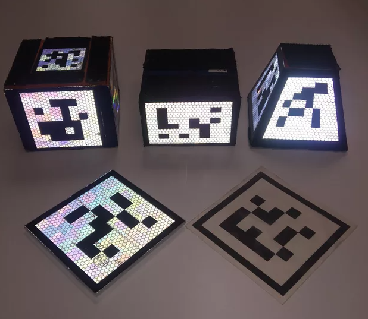
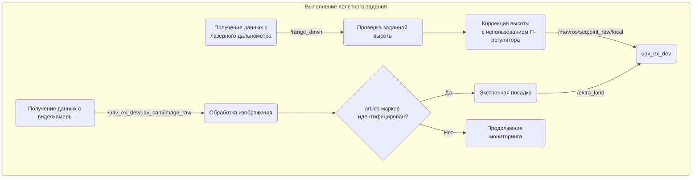
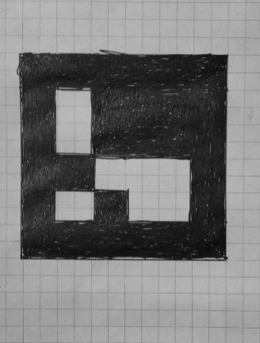
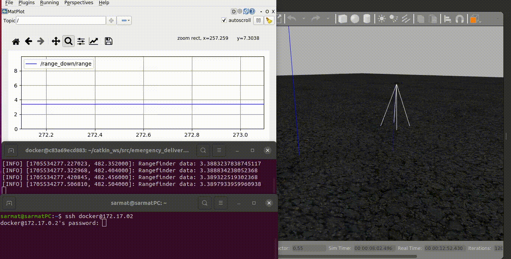

#  Мониторинг и экстренная доставка.

### Постановка задачи.

Мониторинг на заданной высоте участка автомагистрали с помощью робота-квадрокоптера.


В случае обнаружения выставленного участником дорожного движения аварийного [ArUco маркера](https://en.wikipedia.org/wiki/ARTag) (возможные варианты реперных маркеров)



дрону необходимо совершить экстренную посадку (в качестве груза доставки могут быть  средства первой необходимости при ДТП,  устройства  мобильной связи и т.д., которые по весу может перевозить БЛА). Надёжнее выставлять не 1 маркер, а некоторые массивы.

Для внесения  изменений в ПО квадрокоптера и возможностью передачи команд в ручном режиме использовать соединение по SSH протоколу.

### Моделирование в Gazebo, автопилот PX4, мониторинг высоты с использованием rqt.

##### Алгоритм работы БЛА:

1. Взлёт и набор заданной высоты, контроль высоты (в случае если БЛА превысит требуемый параметр он не сможет обнаружить ArUco  маркер)
2. Полёт по заданной траектории от точки  "А" к "Б" и обратно.
3. В случае идентификации ArUco маркера экстренная посадка. 

##### Базовая модель БЛА,  оборудование, сенсоры для размещения и инициализации ПО на борту дрона:

- Сборка модели робота-квадрокоптера **uav_ex_dev**  (../uav_robot_model/uav_ex_dev).
- Базовая модель Iris (../uav_robot_model/iris).
- Видеокамера (../uav_robot_model/navigation_cam). 
- Лазерный дальномер для контроля высоты (../uav_robot_model/rangefinder).
- GPS (../uav_robot_model/gps).
- "Мир" в котором происходит моделирование (../uav_robot_model/worlds).

**Обобщенная диаграмма обработки данных с использованием  сервисов и топиков  ROS:**



 Для приближения имитации к реальной обстановке использовалась видеокамера ноутбука (необходимо [предварительно откалибровать](https://wiki.ros.org/camera_calibration/Tutorials/MonocularCalibration) или использовать готовые настройки, для данного эксперимента это не критично) и подготовленный ArUco маркер:



 После идентификации маркера камерой в топик /extra_land посылается команда посадки.

Моделирование имеет следующий вид  (видео доступно по [ссылке](https://youtu.be/ZFj-Q7RMcpw)):


### Сборка Dockerfile, запуск PX4, Gazebo. Подключение и управление по SSH.  Контроль высоты с использованием rqt.

Скачайте Dockerfile и соберите образ командой (в файле подробные пояснения к командным инструкциям):

```
docker build -t <имя образа:тег> .
```

для того чтобы использовать графический режим на хосте выполните команду:

```
xhost +
```

запустите контейнер с возможностью использования графики на хосте:

```
docker run -it --privileged -e DISPLAY=$DISPLAY -v /tmp/.X11-unix:/tmp/.X11-unix:rw -e LIBGL_ALWAYS_SOFTWARE=0 \
--user=$(id -u $USER):$(id -g $USER) <имя образа:тег>
```

Необходимо подключится к контейнеру:

```
docker exec -it <имя образа:тег> /bin/bash
```

Запуск PX4, Gazebo и сборка модели робота-квадрокоптера **uav_ex_dev** 

```
./start_PX4_Gazebo.sh
```

после запуска PX4 c Gazebo необходимо другом окне терминала подключится к контейнеру  или использовать установленный менеджер терминалов tmux  (вкл/откл мышки tmux set -g mouse on) и запустить скрипт мониторинга :

```
./start_monitoring.sh
```

Анализ и контроль мониторинга высоты топик  range_down, визуализация в  **rqt**.
Подключение и мониторинг имеет следующий вид (видео доступно по [ссылке](https://youtu.be/E0CAYKB52IA)).  Кроме мониторинга можно управлять роботом-дроном по SSH-протоколу. В примере отправляется команда посадки:

```
rosservice call /mavros/set_mode "base_mode: 0
>custom_mode: 'AUTO.LAND'"
```




