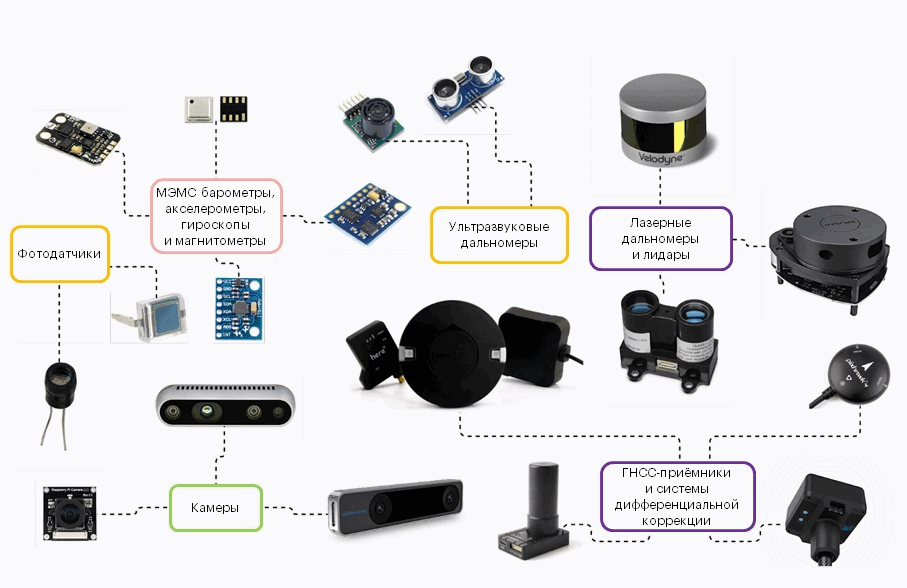
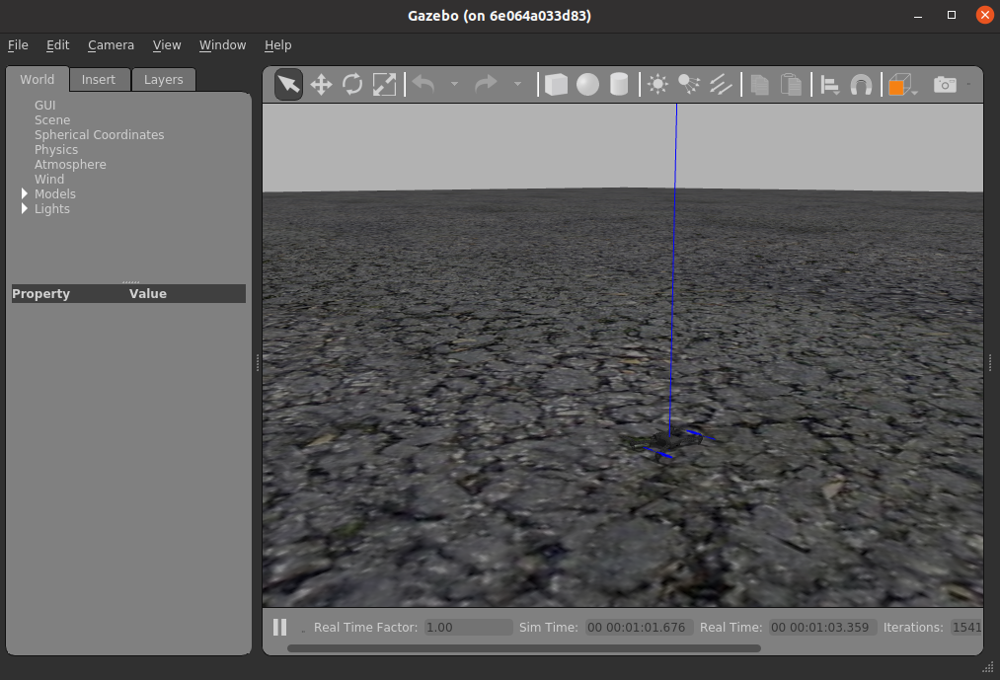
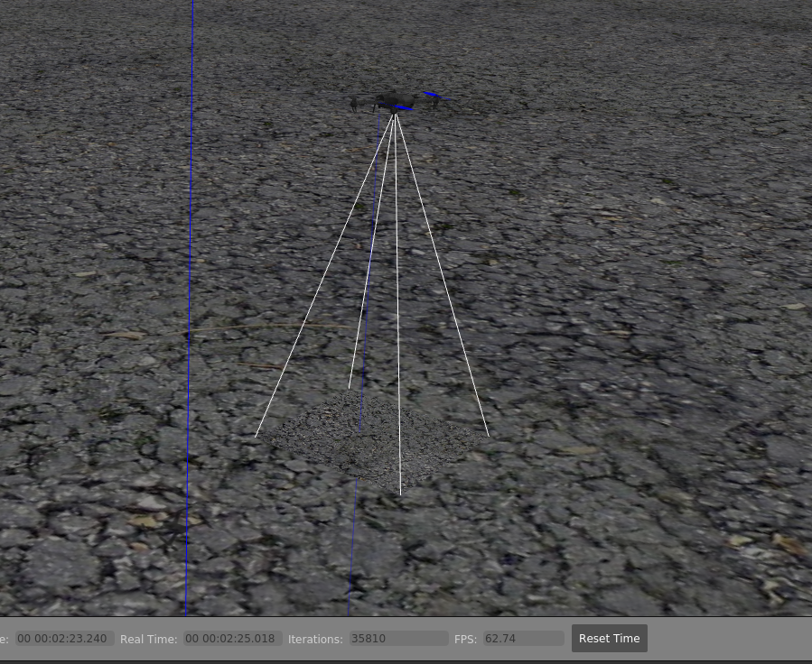

## Программное обеспечение (ПО) для моделирования.

В рамках рассматриваемой задачи (см. README.md) планируется собрание робота-квадракоптера, с разными датчиками  и оборудованием, например: 



В реальных условиях после сборки и запуска аппарата, без предварительного моделирования, существует большая вероятность потери/падения дрона с дорогостоящим оборудованием. С целью имитации полёта и получения информации с советующих датчиков и камеры использовалось следующее ПО:

- [Ubuntu 20.04.6 LTS (Focal Fossa)](https://releases.ubuntu.com/20.04/)
- [ROS Noetic](https://wiki.ros.org/noetic/Installation/Ubuntu)
- [PX4-Autopilot](https://github.com/PX4/PX4-Autopilot)
- [Gazebo](https://gazebosim.org/home) 

## Установка ПО

Установка Ubunu и ROS стандартная и доступна выше по указанным ссылкам (полный пакет ПО в файле **../deploy/Install_All.txt**). 

Пояснения к установочному скрипту **../emergency_delivery/deploy/scripts/deploy_PX4_Gazebo.sh**

```bash
# Переход в каталог пользователя для установки ПО
cd /home/$USER/
# Загрузка репозитория автопилота PX4:
git clone https://github.com/PX4/PX4-Autopilot.git
# Переключение в необходимую ветку
cd PX4-Autopilot
git checkout v1.13.3
# Установка зависимостей:
sudo chmod +x Tools/setup/ubuntu.sh
./Tools/setup/ubuntu.sh
# Сборка 
DONT_RUN=1 make px4_sitl_default gazebo -j$(nproc)
# Копируем базовую модель для собираемой uav_ex_dev
sudo cd  /home/$USER/PX4-Autopilot/build/px4_sitl_default/etc/init.d-posix/airframes
sudo cp 10016_iris 10016_uav_ex_dev
sudo echo "param set COM_RCL_EXCEPT 4" >> 10016_uav_ex_dev
# Загрузка репозитария для получения файлов для сборки имитируемой модели
cd /home/$USER/catkin_ws/src
git clone https://github.com/sarmatae-man/emergency_delivery.git
```

 Для взаимодействия автопилота и компьютера установка mavros. Этот пакет является связующим звеном между автопилотом и нашей системой. Mavros транслирует mavlink сообщения в ROS топики и в обратном порядке. Таким образом мы подключаем автопилот к экосистеме ROS.

```bash
sudo apt-get install ros-noetic-mavros -y
sudo apt-get install ros-noetic-mavros-extras -y
wget https://raw.githubusercontent.com/mavlink/mavros/master/mavros/scripts/install_geographiclib_datasets.sh
bash ./install_geographiclib_datasets.sh -y
rm install_geographiclib_datasets.sh
```

---

###  Скрипт для инициализация окружения ../emergency_delivery/deploy/scripts/init_environment.sh

чтобы не запускать каждый раз, необходимо записать в ~/.bashrc 

```bash
# Инициализация окружения ROS
source /opt/ros/noetic/setup.bash
# Инициализация локального окружения ROS из вашего рабочего пространства
# В случае если не собирались пакеты в catkin_ws, пропустить эту команду
source /home/$USER/catkin_ws/devel/setup.bash
# Инициализация окружения для автопилота PX4
source /home/$USER/PX4-Autopilot/Tools/setup_gazebo.bash /home/$USER/PX4-Autopilot /home/$USER/PX4-Autopilot/build/px4_sitl_default
export ROS_PACKAGE_PATH=/opt/ros/noetic/share:/home/$USER/your_path/PX4-Autopilot:/home/$USER/your_path/PX4-Autopilot/Tools/sitl_gazebo
# Экспорт пути для собираемой модели симулятора
export GAZEBO_MODEL_PATH=/home/$USER/catkin_ws/src/emergency_delivery/uav_robot_model
```
---

###  Запуск симулятора скриптом **../emergency_delivery/scripts/start_PX4_Gazebo.sh**

В скрипте запускается mavros_posix_sitl.launch из пакета PX4 с заданными параметрами собираемой модели, установочного файла модели, "мира" в котором будет производится симуляция.

```bash
PX4_DIR="/home/$USER/PX4-Autopilot"
MODEL_FILES="/home/$USER/catkin_ws/src/emergency_delivery/uav_robot_model"
MODEL="uav_ex_dev"

roslaunch px4 mavros_posix_sitl.launch \
          vehicle:=$MODEL \
          sdf:=$MODEL_FILES/$MODEL/$MODEL.sdf \
          world:=$MODEL_FILESR/worlds/empty.world
```

 В процессе происходит сборка имитируемой модели на основе базовой модели квадрокоптера iris c  подключением и инициализацией необходимого оборудования (файлы инициализации сенсоров и камеры подготовлены и лежат в соответствующих папках), файл инициализации модели ../emergency_delivery/uav_robot_model/uav_ex_dev/uav_ex_dev.sdf, часть кода:

```bash
<model name="uav_ex_dev">
      <include>
        <uri>model://iris</uri>
      </include>

     <include>
        <uri>model://rangefinder</uri>
      </include>
      
     <include>
        <uri>model://gps</uri>
     </include>

      <include>
        <uri>model://navigation_cam</uri>
        <pose>0 0 -0.04 0 1.578 0</pose>
        <cameraName>camera_down</cameraName>
        <frameName>/camera_down</frameName>
      </include>
```

В результате должен будет запуститься симулятор gazebo с аппаратом:



Скрипт **../emergency_delivery/scripts/start_monitoring.sh** запускает передвижение аппарата с камерой и лазерным дальномером (в отдельном окне необходимо инициализировать окружение):



Для проведения эксперимента с видеокамерой необходимо определить её индекс, и вместо ноль, подставить имеющийся,  файл: **../emergency_delivery/scripts/aruco_node.py** строка:

```bash
cap = cv2.VideoCapture(0)
```


 
